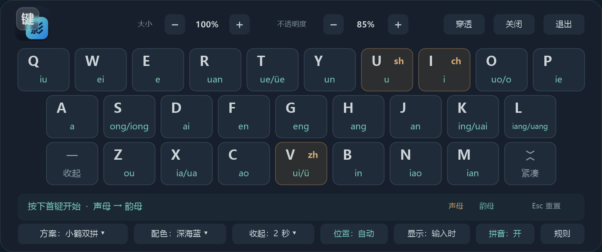
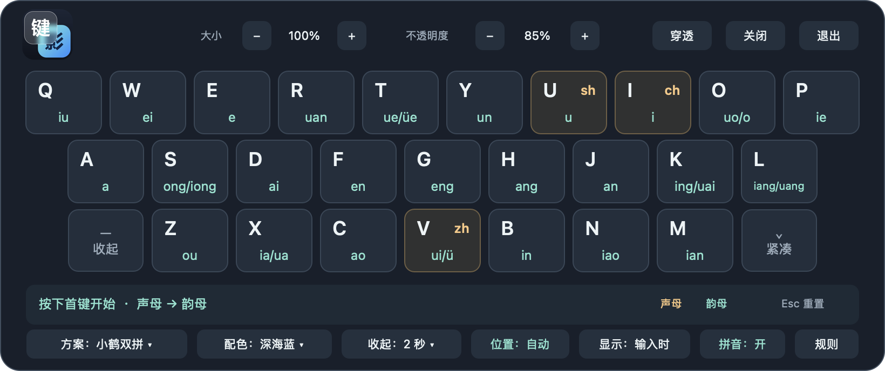
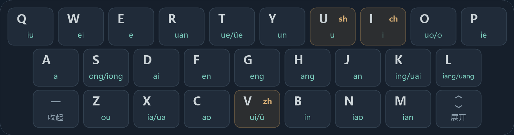
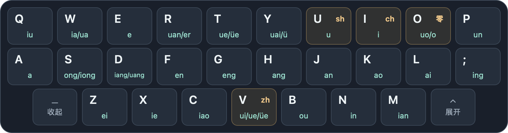

# 键影 · KeyShadow

Windows / macOS 双拼学习提示器：输入时显示半透明键盘、声母韵母与下一键提示，也可常驻或切换紧凑布局。它不代替输入法。

## 下载与使用

版本包见 [Releases](https://github.com/ai-eks/KeyShadow/releases)，开发构建见 [Actions](https://github.com/ai-eks/KeyShadow/actions/workflows/package.yml) 的 Artifacts。系统要求和首次运行步骤见对应平台说明：

| 平台 | 软件包 | 使用说明 |
| --- | --- | --- |
| Windows | 单文件 EXE | [Windows 安装与平台差异](docs/windows/使用说明.md) |
| macOS | Apple Silicon / Intel 通用 DMG | [macOS 安装与权限](docs/macos/使用说明.md) |

### Windows

### macOS

查看紧凑模式

Windows：

macOS：

## 通用操作

Windows 与 macOS 共用以下设置和输入行为；安装、权限、输入法接口及配置位置见各自的平台说明。

### 设置

完整模式的底栏、键盘右键菜单，以及系统托盘 / 菜单栏提供相同的设置入口。菜单中的勾选表示当前选择。

| 设置 | 说明 |
| --- | --- |
| 方案 | 小鹤、自然码、微软、智能 ABC；选择与系统输入法一致的方案。键位和兼容编码见 [双拼方案](docs/双拼方案.md) |
| 配色 | 深海蓝（默认）、石墨灰、暖米白、薰衣紫 |
| 大小 | 顶栏 `− / +` 每次调节 5%，范围 50%–150%；窗口会适应屏幕可用空间 |
| 不透明度 | 顶栏 `− / +` 或菜单调节，范围 35%–95%，默认 85% |
| 收起延时 | 1 / 2 / 3 / 5 / 10 / 30 秒，或「不因停顿收起」；默认 2 秒。常驻模式下仅停止动态提示 |
| 拼音 | 默认开启：首键后突出可接的韵母键，第二键后显示拼音；关闭后仍保留按键高亮 |
| 规则 | 查看当前方案的零声母和特殊拼写说明 |
| 紧凑 / 展开 | M 右侧按钮切换；紧凑模式保留三行键位，隐藏工具栏、拼音结果条和规则区，设置仍可从菜单调整 |

### 位置与显示

两项设置独立，可任意组合：

| 设置 | 模式 | 行为 |
| --- | --- | --- |
| 位置 | 自动 | 优先使用文字光标，其次输入框范围、当前窗口最近一次点击的位置、保存的位置；在输入位置上方为候选词预留空间 |
| 位置 | 固定 | 保持在保存的手动位置；自动跟随不会覆盖它 |
| 显示 | 输入时（默认） | 中文输入时弹出；停顿超过延时、结束输入或切到英文后收起。仅点击输入框、移动光标或切回中文不会触发 |
| 显示 | 常驻 | 保持静态键盘；中文输入时显示动态提示，停顿、结束输入或切到英文只清空提示 |

完整模式拖动顶部空白处，紧凑模式拖动键区或空白处，会切换为固定位置。菜单「恢复位置与透明度」恢复底部居中、100% 大小、85% 不透明度并取消鼠标穿透；位置和显示方式不变。

点击位置只是估算：不支持光标定位的应用中，Tab 切换输入框或方向键移动光标可能使位置偏离。再次点击后，下一次输入重新定位；不同窗口不会共用点击记录。

### 输入提示

小鹤示例：`U → L → shuang`、`N → V → nü`；微软方案支持分号作为第二键，如 `L → ; → ling`。

- 字母按键开始或延续提示；长按保持高亮，不重复推进音节。
- Backspace 将第二键退回第一键，单独退格不会开始提示。
- 空格、数字、标点、回车、Esc、方向键、Tab、功能键及组合快捷键结束当前输入；单独按修饰键不会结束输入。微软方案的第二键分号按双拼处理。
- 停顿收起保留拼音首键，继续输入可以接上；切换应用、输入法状态或双拼方案会清空旧音节。

提示只维护当前两键音节。移动光标、选择候选词或回删更早内容后，可按 Esc 重置；按键照常传给原应用，Esc 也可能取消输入法的组合输入。点击屏幕上的键帽不会向输入法发送按键。

### 收起、关闭与退出

| 操作 | 入口 | 结果 |
| --- | --- | --- |
| 收起 | Z 左侧「收起」或菜单「收起键盘」 | 临时隐藏，常驻模式也会隐藏；下一次中文输入重新显示，固定位置不变 |
| 关闭提示 | 顶栏「关闭」、菜单或快捷键 | 暂停提示，程序仍在托盘 / 菜单栏；输入、改变位置或切换布局都不会解除暂停 |
| 恢复提示 | 菜单、快捷键或再次打开程序 | 恢复提示并取消鼠标穿透；输入时模式预览 4 秒，常驻模式显示静态键盘 |
| 退出 | 顶栏或菜单「退出」 | 结束程序，需要重新打开 |

「关闭 / 恢复」按用户选择的开关状态切换，不按窗口此刻是否可见切换。键盘只是自动收起时，关闭快捷键仍会暂停提示。

| 快捷操作 | Windows | macOS |
| --- | --- | --- |
| 关闭 / 恢复提示 | `Ctrl + Alt + F8` | `Control + Option + F8` |
| 开启 / 关闭鼠标穿透 | `Ctrl + Alt + F9` | `Control + Option + F9` |

macOS 的部分键盘需要同时按 `Fn`。穿透时请从托盘 / 菜单栏操作。设置自动保存，鼠标穿透与关闭提示的状态不跨重启保存。菜单底部可查看程序版本。

打开设置菜单时暂停跟随、自动收起和双拼输入；鼠标停在可操作的键盘上时暂停移动。窗口不抢占输入焦点。

### 隐私与边界

已识别的密码框和只读区域不显示动态提示：输入时模式隐藏键盘，常驻模式只保留静态键盘，手动恢复也不能绕过。**输入框属性不可读、查询失败或超时时，按普通输入框处理，因此未知密码框的按键可能被高亮。** 两平台的状态识别能力见各自说明。

程序不读取输入文本、候选词或已提交内容，不保存输入历史、不写输入日志、不联网。只根据当前按键推算音节；最近点击仅在内存中保留位置坐标与窗口信息。

提示器不改变系统输入法的方案或状态。第三方输入法、特殊编辑器和受保护环境的支持取决于平台接口，混合 DPI 多屏仍需实机验证。

## 文档

| 内容 | 入口 |
| --- | --- |
| 方案键位、零声母与兼容编码 | [双拼方案](docs/双拼方案.md) |
| 开发环境、构建命令与验证方式 | [构建与测试](docs/构建与测试.md) |
| 源码目录与两平台数据同步 | [项目结构](docs/项目结构.md) |
| 版本、打包、签名公证与发布 | [打包与发布](docs/打包与发布.md) |

## 许可证

[MIT](LICENSE)
